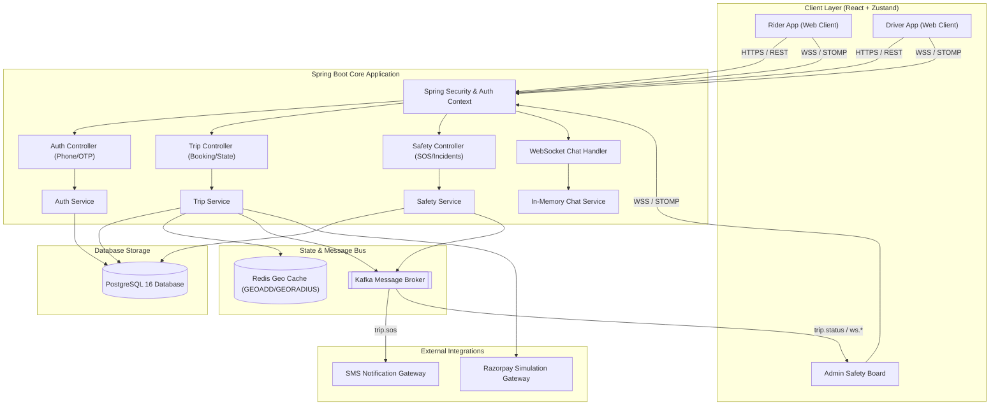

# HerRide — Safe. Reliable. Women-Driven Mobility.

HerRide is an early-stage startup MVP concept and safety-first ride-hailing platform designed exclusively for women in India. The platform directly addresses critical safety concerns in urban transportation by connecting female passengers with verified female drivers, while offering real-time emergency safety tools, trusted-contact ride sharing, and active command-center GPS shielding.

---

## 1. Live Deployment

- **Frontend Client**: [https://herride-six.vercel.app/](https://herride-six.vercel.app/)
- **Backend API**: [https://herride.onrender.com/](https://herride.onrender.com/)
- **Swagger Documentation**: [https://herride.onrender.com/swagger-ui.html](https://herride.onrender.com/swagger-ui.html)

---

## 2. Business & Product Overview

### The Problem
Women in Indian cities frequently face safety anxieties when using public transit or conventional ride-hailing services. Major challenges include:
- Unverified driver profiles.
- Lack of immediate emergency response channels.
- No direct telemetry integration to share active rides with families.
- General discomfort during late-night or solitary commutes.

### Why HerRide Exists
HerRide aims to create a secure, girls-only transportation ecosystem. By combining verified female drivers, automated safety telemetry, and a frictionless mobile experience, HerRide empowers women to travel with complete peace of mind.

### Product Positioning
- **Startup Vision**: Early-stage prototype and MVP preparing for local beta launch in urban metros.
- **Audience**: Female professionals, college students, and senior citizens seeking secure city commutes.
- **Value Proposition**: 100% verified female drivers, GPS-shielded rides, single-tap SOS, and automated SMS route sharing to family members.

---

## 3. Key Features

- **Mobile OTP Authentication**: Frictionless login using Phone Number + OTP. No passwords required by default, inspired by top Indian apps like Rapido and Ola.
- **India-Localized Services**: Indian cities (Delhi, Mumbai, Bangalore, etc.), Rupees currency (`₹`), kilometer metrics, and realistic payment gateway simulation.
- **Five Ride Tiers**:
  1. **Bike**: Quick solo bike commutes.
  2. **Auto Rickshaw**: Spacious three-wheelers.
  3. **Mini**: Economy hatchback rides (e.g. WagonR).
  4. **Sedan**: Premium comfort sedans (e.g. Swift Dzire).
  5. **SUV**: Spacious family SUVs (e.g. Maruti Ertiga).
- **Safety Dispatch Center**: Real-time admin board displaying coordinates and emergency dispatch alarms instantly when a rider triggers SOS.
- **Bilateral Chat & Cancellation**: Active real-time WebSocket chat and cancellation options available up until pickup.
- **Razorpay-Style checkout**: Sandbox checkout supporting UPI (GPay, PhonePe, Paytm), RuPay Cards, Netbanking, and Cash.

---

## 4. System Architecture

### Architecture Diagram


### Data & Service Topology


### Technical Stack Details
- **Backend Core**: Java 21 + Spring Boot 3.5 (configured for REST API routing and STOMP WebSocket communication).
- **Proximity Store**: Redis 7 using spatial index commands (`GEOADD`, `GEORADIUS`) to resolve nearby drivers dynamically.
- **Event Bus**: Apache Kafka 3.x for pub-sub decoupling of notifications, audits, and real-time safety dispatch commands.
- **Storage Database**: PostgreSQL 16 (for relational schemas, trips histories, user records, and safety logs).
- **Security Engine**: JWT (Stateless access tokens + refresh token rotation) integrated with Spring Security filters.
- **Frontend App**: React 18 + Zustand state engine (handling WebSocket STOMP routing and active trip timers).

---

## 5. Technical Use Cases

### Use Case 1: Frictionless Mobile OTP Authentication & Inline Signups
- **Problem**: Traditional username/password auth causes friction in on-the-go mobility apps, decreasing rider conversion rate.
- **Implementation**:
  - The login screen restricts entries to valid 10-digit mobile numbers with code `🇮🇳 +91`.
  - On submitting their mobile number, the backend generates a random 5-digit verification OTP, saves it in an in-memory cache with a 5-minute expiration timer, and outputs the code to the system logs.
  - If the user is unrecognized, the store opens a registration modal collecting Name, Email, and Gender.
  - **Security Rule**: The signup API validates that the user's role is `RIDER` or `DRIVER` and that their gender is strictly `FEMALE`. Any male registration request is immediately rejected.
  - On OTP verify, the system creates the User record with a secure UUID random password (ensuring database constraints are met) and returns JWT access/refresh tokens.

### Use Case 2: Proximity Matchings via Redis GEO Indexing
- **Problem**: Querying nearby driver coordinates within a 3-5 km radius using SQL relational DBs triggers costly full-table geometric scans.
- **Implementation**:
  - Online drivers transmit their coordinates every 8 seconds via `POST /api/v1/drivers/location`.
  - The backend pushes these coordinates directly to a Redis sorted set spatial index using `GEOADD` operations:
    ```
    GEOADD drivers:geo longitude latitude driver_id
    ```
  - When a rider opens the booking dashboard, the frontend requests nearby drivers. The backend executes a fast radial spatial search using `GEORADIUS`:
    ```java
    GeoResults<RedisGeoCommands.GeoLocation<String>> results = 
        redisTemplate.opsForGeo().radius("drivers:geo", 
            new Circle(new Point(lng, lat), new Distance(5, Metrics.KILOMETERS)));
    ```
  - This returns nearby drivers immediately, which the frontend renders as custom moving vehicle icons on a Leaflet map.

### Use Case 3: Decoupled Asynchronous Events Routing via Kafka
- **Problem**: Sync processing of notifications, audits, and safety alarms blocks critical API thread pools, causing request timeouts during spikes.
- **Implementation**:
  - Key business events (ride requests, driver matches, cancellations, and SOS alarms) are published as event packets to specific Apache Kafka topics.
  - **Topics Structure**:
    - `trip.requested`: Decouples driver dispatch matching algorithms.
    - `trip.accepted`: Alerts riders that a driver has matched.
    - `trip.completed`: Triggers dashboard metrics calculations and invoice exports.
    - `trip.sos`: Escalates location coordinates to the emergency dispatcher and contacts.
  - Listeners consume these topics asynchronously to perform notification alerts, database logging, and metrics aggregation.

### Use Case 4: Safety Check-in Engine, SOS Dispatch & Broadcasts
- **Problem**: Emergencies require instant escalation to both emergency networks and families with low latency.
- **Implementation**:
  - During an active ride, the safety engine monitors passenger safety through automated in-app popups.
  - If a user fails to check-in or triggers the **SOS Alarm**, a transaction immediately raises an alert.
  - The safety service publishes to the `trip.sos` Kafka topic.
  - An event handler picks up the alert and:
    - Triggers the Termii SMS gateway to text the passenger's real-time Google Maps location link directly to all linked Trusted Contacts.
    - Broadcasts the telemetry data (Rider Name, Contact, Plate number, Coordinates) to `/topic/admin/sos` via WebSockets.
  - The **Admin Safety Dispatch Board** receives the STOMP packet and flashes an red audio-visual siren immediately.

### Use Case 5: Bilateral STOMP WebSocket Chat Room Routing
- **Problem**: Storing high-frequency chat messages directly to Postgres during active trips degrades disk I/O performance.
- **Implementation**:
  - Real-time communications are routed via STOMP over WebSockets.
  - Chat channels are created dynamically on a topic specific to each active trip: `/topic/trips/{tripId}/chat`.
  - Message payloads contain the trip ID, sender email, sender name, message body, and timestamp.
  - The backend maintains an in-memory thread-safe cache using a `ConcurrentHashMap` to hold the chat logs during the active trip cycle.
  - On page refresh, the store calls `GET /api/v1/trips/{tripId}/chat` to restore the active conversation history. When the trip ends, the cache clears.

### Use Case 6: Resilient Local Checkout Sandboxing (Razorpay/Paytm style)
- **Problem**: Network timeouts or API outages on external payment systems (like Paystack/Stripe) can freeze passenger checkout screens.
- **Implementation**:
  - A fallback circuit breaker is configured on the backend payment initializer.
  - If the Paystack client encounters a network timeout, gateway crash, or error, the client catches the exception and intercepts the request.
  - Instead of returning a `503 Service Unavailable` error, the payment service initiates a fallback transaction and supplies a secure link to the localized Indian sandbox checkout.
  - The checkout UI simulates Razorpay/Paytm, letting riders complete payments via UPI (GPay, PhonePe, Paytm), RuPay Cards, Netbanking, or Cash, maintaining full operational uptime.

### Use Case 7: Real-Time Rider Aggregated Metrics Engine
- **Problem**: Running heavy SQL aggregate queries (`SUM`, `COUNT`) on the entire trip history whenever admin searches passengers slows down page renders.
- **Implementation**:
  - Added lifetime tracking metrics to the passenger registry.
  - The `UserController` returns `totalRides` and `totalSpent` (Rupees) columns for each passenger.
  - Calculations are optimized on the backend: queries are targeted using indices on the user ID and the status `COMPLETED` of the trip repository.
  - The frontend React admin dashboard processes this data and displays passenger registry analytics.

---

## 6. Getting Started

### Prerequisites
- Java 21 JDK
- Node.js (v18+)
- Docker & Docker Compose

### Environment Setup
Create a `.env` file in the root directory:
```env
DB_URL=jdbc:postgresql://localhost:5438/HerRide?options=-c%20timezone=UTC
DB_USERNAME=postgres
DB_PASSWORD=postgres
REDIS_HOST=localhost
REDIS_PORT=6379
KAFKA_SERVERS=localhost:9092
JWT_SECRET=404E635266556A586E3272357538782F413F4428472B4B6250645367566B5970
PAYSTACK_SECRET_KEY=sk_test_your_key_here
TERMII_API_KEY=your_termii_api_key_here
```

### Run Infrastructure
Start PostgreSQL, Redis, Kafka, and Grafana:
```bash
docker compose up -d
```

### Start Backend
Run the Spring Boot application:
```bash
# Windows (PowerShell)
.\mvnw spring-boot:run

# Linux / macOS
./mvnw spring-boot:run
```

### Start Frontend
Navigate to the frontend folder and start the dev server:
```bash
cd frontend
npm install
npm run dev
```
Open [http://localhost:5173](http://localhost:5173) in your browser.

---

## 7. API References

### Authentication
- `POST /api/v1/auth/otp/send`: Generates and sends OTP, returns registration state.
- `POST /api/v1/auth/otp/verify`: Verifies code, auto-registers new users, and returns JWT tokens.

### Location Telemetry
- `POST /api/v1/drivers/location`: Updates driver coordinates in Redis (Driver only).
- `GET /api/v1/drivers/nearby`: Returns list of online drivers within radius (Rider only).

### Trips
- `POST /api/v1/trips/request`: Requests a new booking.
- `POST /api/v1/trips/{id}/accept`: Driver accepts ride.
- `PATCH /api/v1/trips/{id}/status`: Advances trip state.
- `POST /api/v1/trips/{id}/cancel`: Cancels active ride.

---

## 8. End-to-End User & Testing Flow

To test the complete platform journey from onboarding to payment completion, follow these sequential steps:

### Step 1: Create a Driver Account
1. Open the application (local or deployed link).
2. Go to the sign-up flow, enter a new phone number, and choose **Female Driver** (Gender: **Female**).
3. Submit the verification OTP (frictionless testing auto-fills this).
4. You will be redirected to the **Driver Dashboard** which displays a warning that **"Verification Documents Required"**.
5. Click **Go to Verification Center**, fill out your vehicle details, and submit.
6. The dashboard will now transition to showing **"Account Verification Pending"**.

### Step 2: Approve the Driver via Admin Panel
1. Sign out of the driver account, or open a new incognito window.
2. Go to the sign-in page, click **"System Administrator Login"** at the bottom, and log in with the admin credentials:
   - **Email**: `admin@herride.com`
   - **Password**: `admin123`
3. Go to the **Drivers** tab from the Admin menu.
4. Locate the newly registered driver in the pending queue and click **Approve Driver**.

### Step 3: Go Online as Driver
1. Log back in as the approved driver user.
2. Toggle status to **ONLINE** (pulsing green indicator). The driver is now visible on the map and active in the backend dispatch pool. Keep this tab open.

### Step 4: Book a Ride as Rider
1. In a separate browser window, register or log in as a **Rider** (Gender: **Female**).
2. Enter pickup and destination addresses on the map screen.
3. Select your ride tier (e.g. Sedan) and click **Confirm Booking**.
4. The screen transitions to **"Matching with Driver"**. The backend assigns the online driver.

### Step 5: Accept & Drive (Journey Progression)
1. Switch back to the **Driver** window. An incoming ride request overlay modal will appear.
2. Click **Accept & Navigate**.
3. Progression states are managed step-by-step:
   - **Start Driving (En Route)** -> Transitions trip status to `DRIVER_ARRIVING`.
   - **Arrived at Pickup Location** -> Transitions trip status to `RIDER_PICKED`.
   - **Start the Ride** -> Transitions trip status to `IN_PROGRESS`.
   - **Complete the Ride** -> Transitions trip status to `COMPLETED`.
4. Switch to the Rider window to verify coordinates and states updating live in real-time.

### Step 6: Checkout & Payment
1. Once the trip is completed, the Rider screen prompts for payment.
2. Click **Pay Now** to open the sandbox Paystack payment gateway simulator.
3. Complete the mock payment using UPI/Card.
4. Upon successful payment completion, the rider is redirected back to the app, showing the trip marked as `PAID` and opening the reviews/ratings form.

---

## 9. License
HerRide is open-source software licensed under the MIT License. Built as a startup MVP concept.

